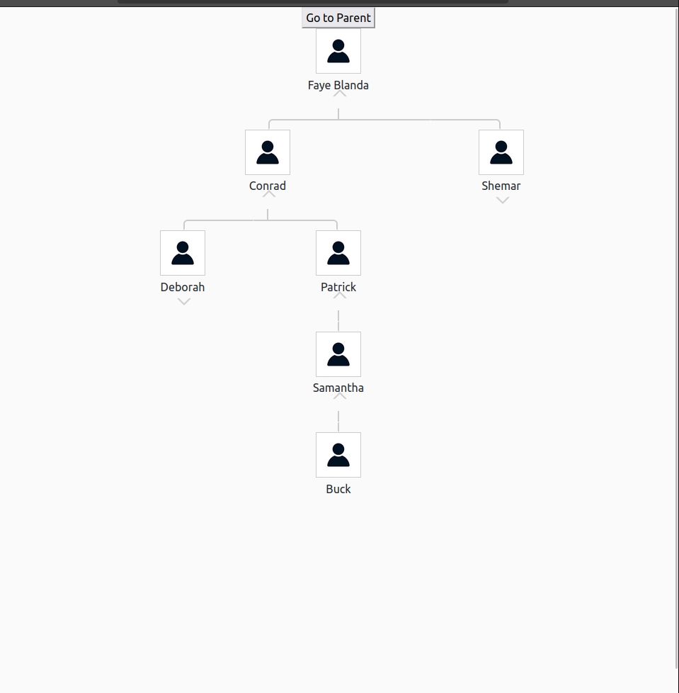
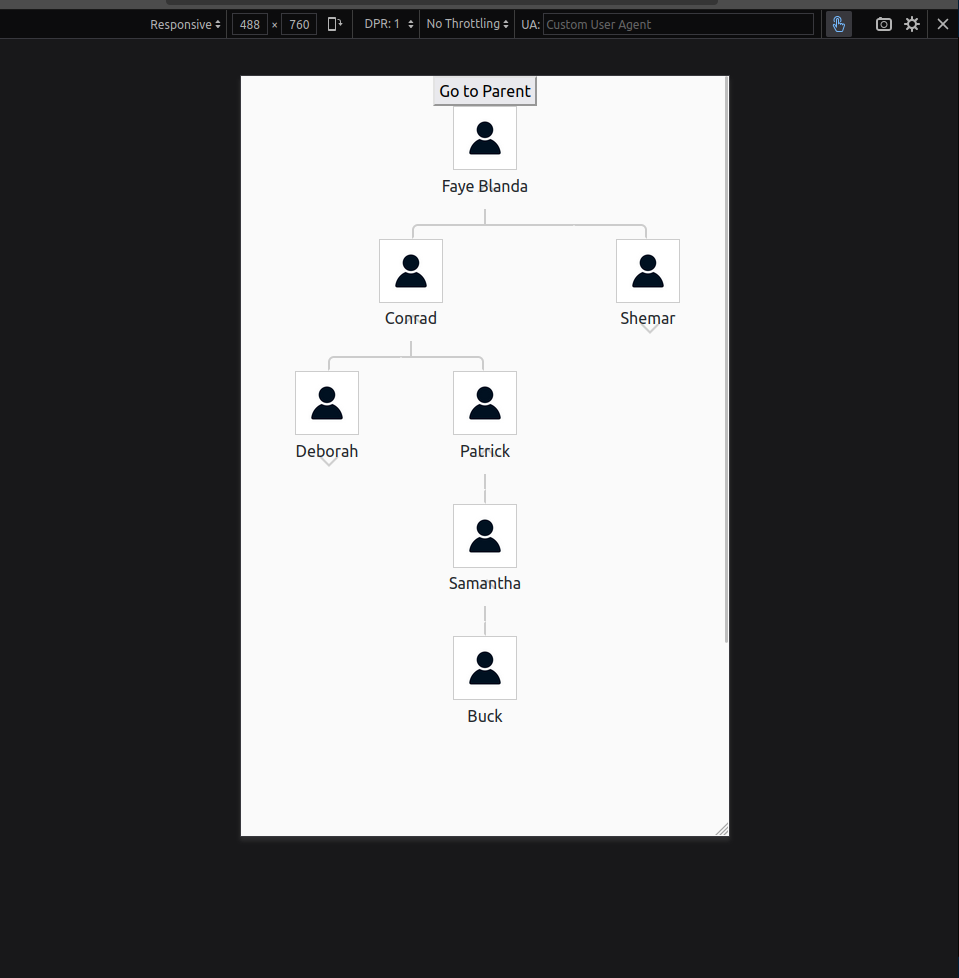

# Genealogy Tree for Daxcsa Company

## Problem Statement

A genealogy tree is a tool to visualize genetic and/or relational connections between individuals. This project involves creating a graphical binary tree diagram for **Daxcsa**, a direct sales company where independent distributors buy cryptocurrency packages and earn commissions from sales made by people they refer into the program.

### Objectives

1. Display a binary tree structure for a subset of Daxcsa's genealogy using the provided JSON file.
2. Ensure the tree supports:
   - A mobile-friendly design.
   - Efficient performance.
   - Easy navigation between parents and children.
   - Accurate binary placement of nodes (left or right).
3. Provide a way to display detailed information for each node, including:
   - Username
   - Full Name
   - Email
   - Status
   - Product
   - Category

### Key Considerations

- The tree should **not display all levels** at once but must provide a way to navigate through them.
- For mobile devices, **some levels should be hidden** to maintain usability and readability.
- Navigation should allow users to:
  - Replace the root node with a selected node.
  - Extend the tree to display children dynamically.

---

## Solution Overview

This project implements a **binary tree UI** for Daxcsa with:

- **Dynamic Level Loading**: Displays only a limited number of levels at once to optimize performance and enhance user experience.
- **Node Interaction**: Clicking a node shows detailed information in an overlay or side panel.
- **Mobile Responsiveness**: Adjusted layouts and hidden levels ensure usability on small screens.
- **Navigation Features**:
  - Navigate to a parent or child node.
  - Dynamically extend or collapse the tree.

---

## Tools & Libraries

- **Vue.js**: Core framework for building the UI.
- **SCSS**: For custom and responsive styling.
- **[vue-binary-tree](https://github.com/mdiaz00147/vue-binary-tree)**: Used as a reference for tree rendering and navigation logic.
- **JSON Data**: Contains the sample subset of the Daxcsa genealogy tree.

---

## Features

1. **Graphical Representation**:

   - Displays the genealogy tree with binary placement of nodes (left/right).
   - Provides smooth animations for expanding and collapsing nodes.

2. **Detailed Information Panel**:

   - Displays user details like username, email, status, and product info upon clicking a node.

3. **Responsive Design**:

   - Ensures usability across desktop and mobile devices.
   - Automatically hides certain levels on mobile for better readability.

4. **Tree Navigation**:
   - Navigate to parent or child nodes easily.
   - Dynamically load additional levels without overwhelming the UI.

---

## Installation & Usage

### Prerequisites

- **Node.js** (v16+)
- **Vue CLI** (v5+)

### Steps to Run the Project

1. Clone the repository:
   ```bash
   git clone <repository-link>
   cd <repository-folder>
   ```
2. Install dependencies:
   ```bash
   npm install
   ```
3. Start the development server:
   ```bash
   npm run serve
   ```
4. Open the application in your browser:
   ```
   http://localhost:8080
   ```

---

## Project Structure

```plaintext
src/
├── assets/              # Static assets (images, fonts, etc.)
├── components/          # Vue components
│   ├── BinaryTree.vue   # Core tree component
│   ├── NodeDetails.vue  # Detailed info modal for nodes
├── styles/              # SCSS styles
│   ├── _tree.scss       # Styles for the binary tree
│   ├── _responsive.scss # Responsive design styles
├── views/               # Main views
│   ├── TreeView.vue     # Main page displaying the binary tree
├── data/                # JSON data
│   ├── treeData.json    # Sample genealogy tree data
```

---

## Screenshots

### Desktop View



### Mobile View



---

## Credits

This project was inspired by the [vue-binary-tree](https://github.com/mdiaz00147/vue-binary-tree) package.

---

## License

This project is licensed under the MIT License. See the [LICENSE](LICENSE) file for details.

---

## Contribution

Feel free to submit issues or pull requests to improve the project!

---

This README provides clarity on the project purpose, implementation details, and usage instructions while giving due credit to the referenced package. Let me know if you'd like to tweak anything further!
